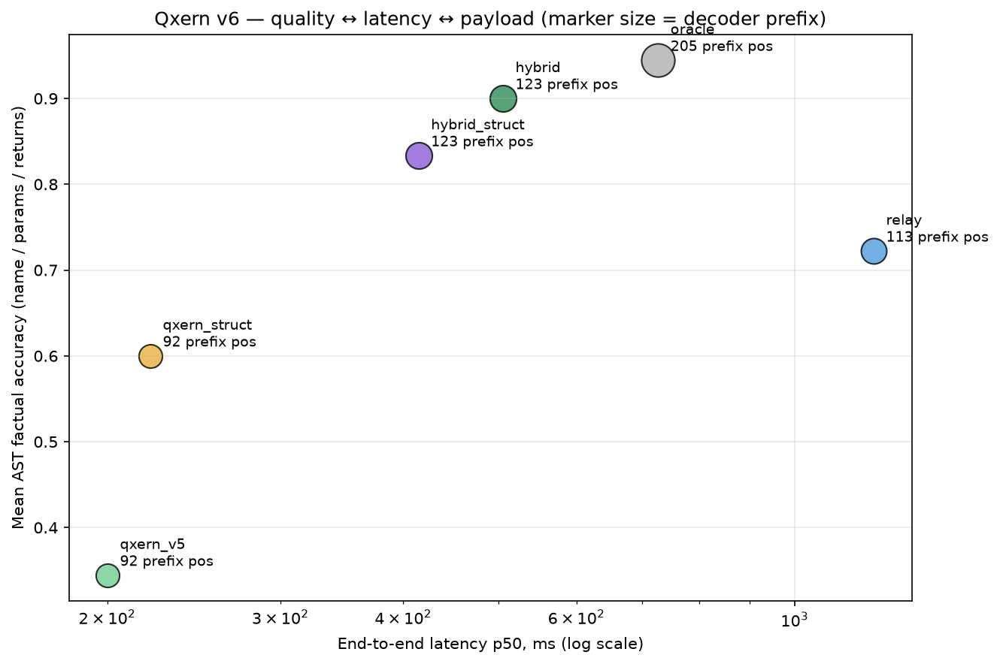
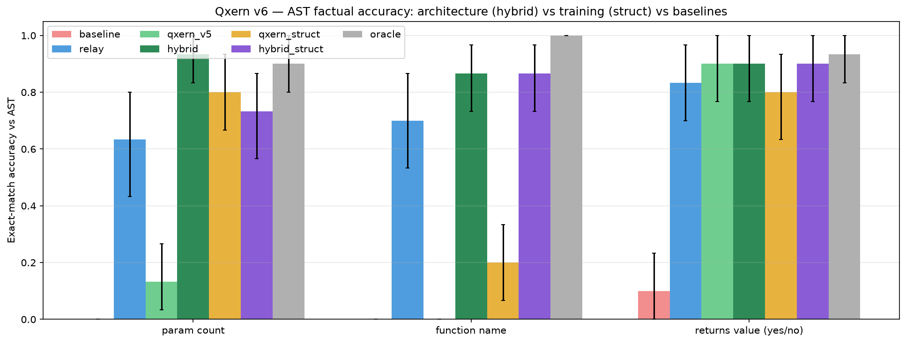
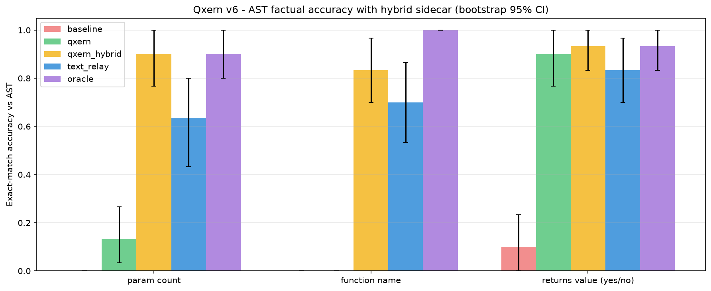
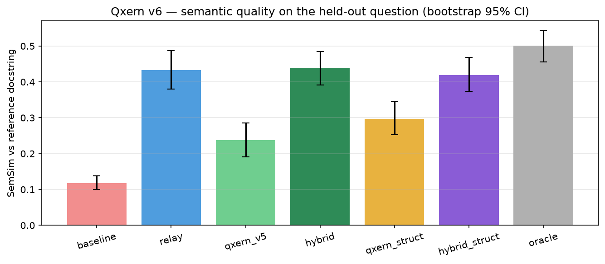
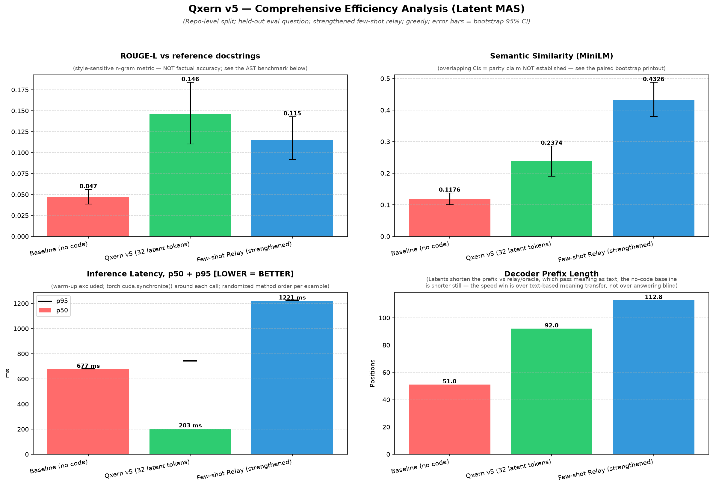
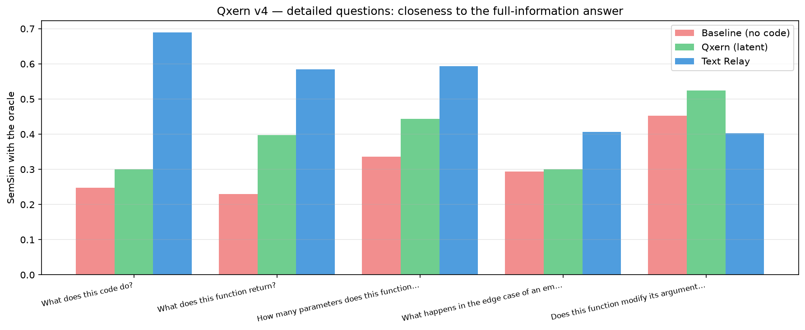
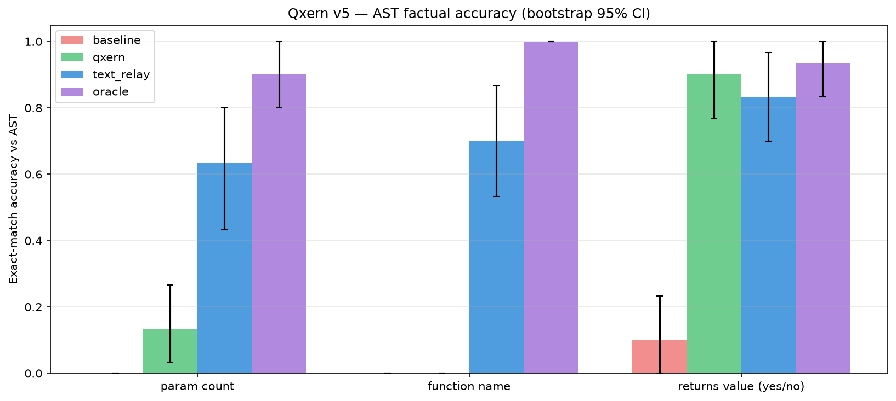
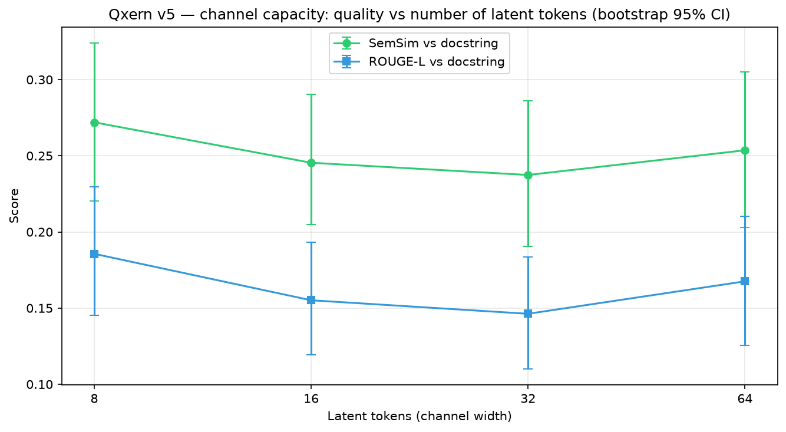

# Qxern — латентный семантический канал + символьный AST-sidecar для общения LLM о коде

> **Одно честное предложение:** непрерывные латенты — быстрый *семантический* канал между двумя LLM, но они структурно не способны переносить *точные символы* (идентификаторы, имена); крошечный детерминированный AST-sidecar возвращает точность ценой десятков токенов — и каждый клейм ниже заперт за guard-воротами и paired bootstrap CI, посчитанными по сырым данным прогона.

**[English version → README.md](README.md) · Русская версия (этот файл)**

🤗 **Веса и int4-бандл:** [huggingface.co/aximi/qxern-v6-deploy-int4](https://huggingface.co/aximi/qxern-v6-deploy-int4)



---

## 👋 Об авторе

Мне **15 лет**, я из России.

- Всё до **v5** сделано за **одну неделю на бесплатных GPU Kaggle**.
- **v5 → v6** — на **арендованной RTX 5090 32 GB** (vast.ai).
- Сейчас денег на аренду GPU нет, так что проект может и не продолжиться — всё измеренное опубликовано здесь и воспроизводится из ноутбука.
- Честность про инструменты: первые наброски — **Qwen-3.7max**, полировка кода — **Claude**. Архитектурные решения, дизайн экспериментов и все измерения — мои.

**Почему «Qxern»?** **Q** — первым помогал Qwen (и Q звучит как quantum, по-научному) · **x** — как *axim* · **ern** — my name is Ernest.

## Зачем? Почему?

**Вопрос, с которого начался проект: why should AI agents talk to each other in a human language that isn't their native one? (зачем ИИ-агентам общаться между собой на человеческом языке, если он для них не родной?)**

Модели думают непрерывными векторами; текст — лоссовая, потокенная сериализация, навязанная им для *нашего* удобства. Когда две модели говорят текстом, отправитель платит латентностью генерации, а богатая внутренняя семантика сплющивается в строку, которую получатель заново кодирует. Если бы модели могли обмениваться *смыслом* напрямую, мультимодельные пайплайны — рои агентов, код-ревью-боты, каскады моделей — стали бы быстрее и дешевле.

Но мои измерения показывают, где именно мечта ломается: непрерывный латентный канал, обученный дистилляцией, хорошо переносит **поведенческую семантику** и совсем не переносит **дискретные символы**. Qxern v6 — прагматичный ответ: **смысл через латенты, символы через детерминированный символьный канал, текст — только как редкий fallback.** Не воюй с геометрией — обходи её.

## Что это?

Qxern — эксперимент по **латентной коммуникации между моделями**: модель A (`Qwen2.5-Coder-1.5B`) кодирует сниппет кода в **32 латентных токена** через обученный Q-Former-адаптер; замороженный декодер (`Qwen3.5-0.8B`) отвечает на вопросы о коде, используя только этот латентный пакет — текст кода не передаётся.

Проект прошёл честную арку:

- **Клейм v4:** «латенты лучше и быстрее текста» — **не пережил** честно усиленный текстовый relay-бейслайн.
- **Вывод v5:** чистые латенты выигрывают в скорости (**6.0×**) и бинарных поведенческих фактах (`returns` 0.90), но **полностью теряют точные символы** (имена функций 0.00 против 0.70 у relay, число параметров 0.13 против 0.63). Ширина канала ни при чём: кривая ёмкости 8→64 токена плоская.
- **v6 (этот репозиторий):** не заставляем непрерывный канал быть lossless-кодеком. Пакет становится `[семантические латенты] + [детерминированный AST-sidecar]` (сигнатура / арность / поведенческие флаги / литералы — парсятся `ast`, без LLM, микросекунды, ~30 токенов). **Адаптивный роутер** выбирает latent-only / latent+sidecar / relay по типу вопроса.

## Ключевые результаты (по сырым данным прогона)

Все числа посчитаны из [`results/qxern_v6_results.json`](results/qxern_v6_results.json) (n=30 held-out функций для AST-фактов, n=50 для SemSim/latency; CodeSearchNet, repo-level split). Точность/SemSim — средние, латентность — p50, пакет — медианная длина префикса. (На графике v5 analysis показано *среднее* — 112.8 для relay — поэтому оно отличается от медианы 122 в таблице; префикс relay зависит от длины кода, 74–127.)

| Система | имя функции | число параметров | returns | SemSim | p50 мс | пакет (prefix tok) |
|---|---|---|---|---|---|---|
| baseline (без кода) | 0.00 | 0.00 | 0.10 | 0.12 | 678 | 51 |
| relay (усиленный текст) | 0.70 | 0.63 | 0.83 | 0.43 | 1222 | 122 |
| qxern_v5 (чистые латенты) | 0.00 | 0.13 | 0.90 | 0.24 | **202** | 92 |
| **hybrid** (латенты + sidecar, без переобучения) | **0.87** | **0.93** | **0.90** | **0.44** | 511 | 122 |
| qxern_struct (переобучен, без sidecar) | 0.20 | 0.80 | 0.80 | 0.30 | 223 | 92 |
| **hybrid_struct** (оба) | **0.87** | 0.73 | **0.90** | 0.42 | 420 | 122 |
| oracle (код текстом) | 1.00 | 0.90 | 0.93 | 0.50 | 736 | 170 |

**Guard-ворота: ПРОЙДЕНЫ обоими гибридами.** Самоналоженные критерии «не сделать хуже» (`returns ≥ 0.88`, просадка SemSim vs чистые латенты ≤ 0.01, `имена ≥ 0.65`, `параметры ≥ 0.60`, ускорение vs relay ≥ 2×) проходят для `hybrid` и `hybrid_struct` и **валятся для `qxern_struct`** (имена 0.20 < 0.65). Этот провал — суть абляции: **переобучение само по себе точные символы не возвращает — возвращает sidecar.**

**Paired bootstrap против relay** (10 000 ресемплов, 95% CI):

- zero-shot **hybrid**: число параметров **+0.30 [+0.10, +0.50] — значимо**; имена +0.17 [−0.03, +0.37] и returns +0.07 [0.00, +0.17] — положительны, но не значимы при n=30; SemSim неотличим — всё это при **p50-латентности в 2.39× ниже**.
- **hybrid_struct**: все дельты точности статистически неотличимы от relay при **латентности в 2.91× ниже**.

**Контрастивный пробинг** (мой любимый результат): код, отличающийся *только именами идентификаторов*, схлопывается в (почти) одну точку латентного пространства — `cos(оригинал, переименованный) = 0.985` против `cos(оригинал, другая функция) = 0.930`. Идентификаторы физически не доезжают до декодера. `names = 0.00` — это **геометрия** канала, а ��е баг; поэтому sidecar — архитектурная необходимость, а не костыль.

### Графики бенчмарков

| График | Файл |
|---|---|
| v6: AST-факты по системам (главная абляция) |  |
| v6: первая zero-shot проверка гибрида (отдельная ранняя eval-ячейка — 0.90/0.83/0.93, чуть отличается от строки hybrid в главной таблице) |  |
| v6: SemSim с 95% CI |  |
| v5: анализ главного бенчмарка |  |
| v4: детальные вопросы, SemSim по каждому вопросу (файл остался под именем v5) |  |
| v5: точность AST-фактов |  |
| v5: ёмкость канала 8→64 токена (плоско!) |  |

## Честные ограничения (прочти, прежде чем цитировать числа)

- **Выигрыш по именам статистически не значим.** hybrid обгоняет relay по именам 0.87 против 0.70, но 95% CI (+0.17 [−0.03, +0.37]) пересекает ноль при n=30. Не цитируй «значимо лучшие имена»; *значимый* выигрыш — число параметров (+0.30) при латентности в 2.4× ниже и без деградаций.
- **Переобучение — не бесплатная победа:** `hybrid_struct` быстрее (420 против 511 мс), но роняет число параметров до 0.73 против 0.93 у zero-shot гибрида. Тяжёлую работу делает архитектура; обучение покупает скорость, а не точность.
- SemSim считается против **ответов учителя**, поэтому у relay (то же семейство моделей, что и учитель) встроенное преимущество; SemSim также любит многословные ответы.
- n=30 eval-функций (50 для SemSim/latency), один GPU, один seed, маленькие модели (1.5B + 0.8B). Направленное свидетельство, а не eval уровня статьи.
- `transformers` ставился с `main` в течение недели; для точного воспроизведения зафиксируй `QXERN_TRANSFORMERS_REF` на SHA коммита.
- Латентность — p50 на одном GPU с прогревом, CUDA-синхронизацией и рандомизированным порядком — но всё равно железо-специфична (RTX 5090).

## Чем это отличается от C2C и LatentMAS?

Я придумал и сделал Qxern **до того, как узнал, что кто-то ещё занимается латентной коммуникацией между моделями**. Потом выяснилось, что область существует — и это отличная новость: направление не безумное.

| | **Qxern (этот репозиторий)** | **[C2C — Cache-to-Cache](https://arxiv.org/abs/2510.03215)** (ICLR'26) | **[LatentMAS](https://arxiv.org/abs/2511.20639)** (ICML'26) |
|---|---|---|---|
| Среда передачи | явный компактный пакет: 32 латентных токена из обученного Q-Former + детерминированный AST-sidecar | проекция и слияние KV-кэшей через обученный fuser | hidden states последнего слоя как «латентные мысли» + общая латентная рабочая память |
| Обучение | маленький адаптер, дистиллированный от учителя | обучаемая fuser-сеть | без обучения |
| Домен | понимание кода; проблема точных символов | общий multi-LLM QA | multi-agent reasoning |
| Главный вопрос | *why should AI agents talk to each other in a human language that isn't their native one?* | могут ли LLM общаться через KV-кэши? | могут ли агенты сотрудничать без текста? |
| Точные символы | явно измерены (names 0.00), возвращаются символьным AST-каналом | не в фокусе | не в фокусе |

Код: [thu-nics/C2C](https://github.com/thu-nics/C2C) · [Gen-Verse/LatentMAS](https://github.com/Gen-Verse/LatentMAS)

**Почему Qxern — не копия:**

- **Другая среда.** Qxern передаёт явный, компактный, инспектируемый пакет (32 латента + ~30 токенов sidecar) между двумя *разными* маленькими моделями. C2C сливает KV-кэши; LatentMAS шарит сырые hidden states в рабочей памяти. Три разные точки пространства дизайна.
- **Другой вопрос.** C2C и LatentMAS доказывают, что латентов *достаточно* (и показывают впечатляющие приросты). Qxern измеряет, **где их недостаточно**: плоская кривая ёмкости 8→64, `names = 0.00`, пробинг name-инвариантности `cos = 0.985`. Вывод — *гибрид*: непрерывный канал для смысла, символьный — для точности.
- **Негативные результаты — и есть вклад.** Ни в одной из работ нет AST-sidecar, guard-ворот, кривой качество↔latency↔размер пакета и геометрического объяснения потери символов. Конвергентная эволюция, независимое исполнение.

## Адаптивный роутер

Режим выбирается по типу вопроса: семантика/поведение → чистые латенты (p50 202 мс); точные символы → латенты + sidecar (p50 511 мс); дословное воспроизведение → редкий fallback в relay (p50 1222 мс). Точность там, где нужна, скорость везде остальное. См. [`sidecar_router.py` на HF](https://huggingface.co/aximi/qxern-v6-deploy-int4/blob/main/sidecar_router.py) (чистый `ast` + роутинг, работает на CPU, LLM не нужен).

## Структура репозитория

```
qxern/
├── README.md                        # английская версия (основная)
├── README.ru.md                     # этот файл
├── Qxern_v6_hybrid_sidecar.ipynb    # весь пайплайн: ячейки 1–10 = v5, 11–17 = v6
├── assets/                          # графики бенчмарков (см. выше)
└── results/
    ├── qxern_v6_results.json        # все сырые числа бенчмарков (по-примерно)
    └── teacher_answers.json         # кэш генераций учителя
```

> ⚖️ **Весов в git нет.** Все обученные адаптеры (8/16/32/64-tok, struct) и int4-квантованные модели лежат на Hugging Face: [aximi/qxern-v6-deploy-int4](https://huggingface.co/aximi/qxern-v6-deploy-int4).

## Воспроизведение

1. Арендуй GPU (проверено: RTX 5090 32 GB на vast.ai; всё до v5 работало на бесплатных Kaggle T4/P100).
2. Открой `Qxern_v6_hybrid_sidecar.ipynb`. Задай `QXERN_DIR` (по умолчанию `/workspace/Qxern`) и зафиксируй `QXERN_TRANSFORMERS_REF`.
3. Запусти ячейки 1–10 (пайплайн v5: дистилляция учителя → обучение адаптера → бенчмарк v5). Чекпоинты кэшируются, повторные запуски дешёвые.
4. Запусти ячейки 11–17 (v6: sidecar → zero-shot гибрид → контрастивный пробинг → абляция struct-переобучения → главный бенчмарк v6 с guard-воротами → роутер).

Опциональные флаги: `RUN_CAPACITY_CURVE` (воспроизвести плоскую кривую 8–64), `RUN_LLM_JUDGE`, `RUN_STRUCT_RETRAIN`.

Или пропусти обучение и возьми готовые веса:

```python
from huggingface_hub import snapshot_download
path = snapshot_download("aximi/qxern-v6-deploy-int4")
```

## Чего НЕ делать (зафиксированные уроки)

- Не увеличивай ширину латентов — кривая ёмкости плоская.
- Не переобучай end-to-end с нуля — потеряешь работающий `returns`.
- Не проталкивай весь код через sidecar — это замаскированный relay.
- Не усредняй метрики в одно число — лучшие имена не должны маскировать деградацию поведенческих фактов.
- Не заявляй «качество без потерь», не измерив латентность и размер пакета.

## 🔮 Будущее

Упорядоченные следующие шаги — всем нужны деньги на GPU, поэтому проект пока заморожен:

1. **Масштабировать eval:** n ≥ 300, несколько seed — выигрышу по именам (+0.17) нужен больший n для значимости; дальше модели побольше и языки кроме Python.
2. **Fusion-адаптер** (copy/pointer-механизм), обучаемый при замороженном семантическом пути — чтобы декодер использовал sidecar ещё лучше, чем zero-shot.
3. **VQ / дискретное бутылочное горлышко** — «чистое» латентное решение для символов: непрерывные латенты интерполируют, символы — нет.
4. **Confidence gate** по энтропии декодера для автоматического fallback в relay (сейчас роутер работает по типу вопроса).

Если у тебя есть свободные GPU-часы и это кажется интересным — открой issue.

## Лицензия

Apache-2.0.
